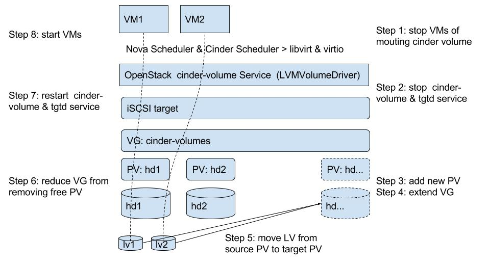

# Migrating LVM-drived cinder volumes - 迁移OpenStack LVM驱动的cinder volumes

## Thanks

Thank University of Zurich (UZH) Grid Computing Competence Center (GC3). They have done complete works in production: [Moving LVM volumes used by a Cinder storage](https://www.gc3.uzh.ch/blog/Moving_lvm_volumes/)

参考原文的链接

## Details of my lab

Google drive - https://drive.google.com/folderview?id=0B3L1U5YASdWzLVBISVpaUHlwcGc&usp=sharing

操作记录的连接

## Abstract

## Content

_TBC_